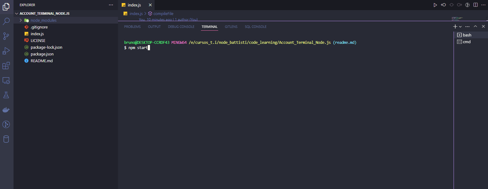
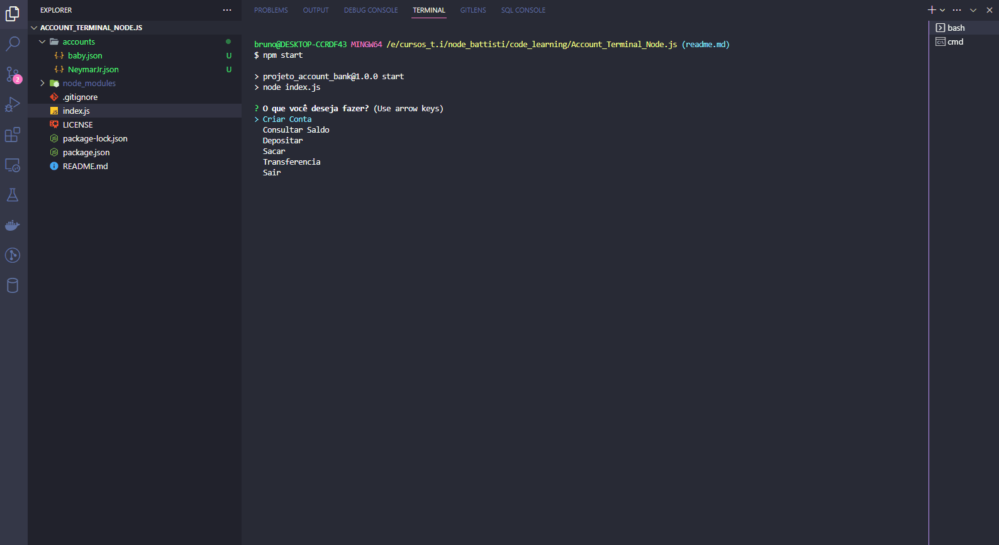

# Account_Terminal_Node.js 🏦

Conta bancária com a interface no Terminal Bash 🏦

💰 Projeto de conta bancária com criação de arquivos em formato .json com conteudo ```{"balance": 00}``` para manipular, armazenar ou retirar quantias da conta. 💰

#

<div align='center'>
<h3>Stacks 💻</h3>


</div>

#

<div align='center'>

### Bibliotécas
     Inquirer
     Chalk
     Fs

</div>

#

<div align='center'>

#### Iniciar Projeto
    npm start
</div>


#

<div align='center'>
    <h3>Criação de Contas</h3>
    
</div>

<div align='center'>
    <h3>Operações Bancárias</h3>
    
</div>


        


